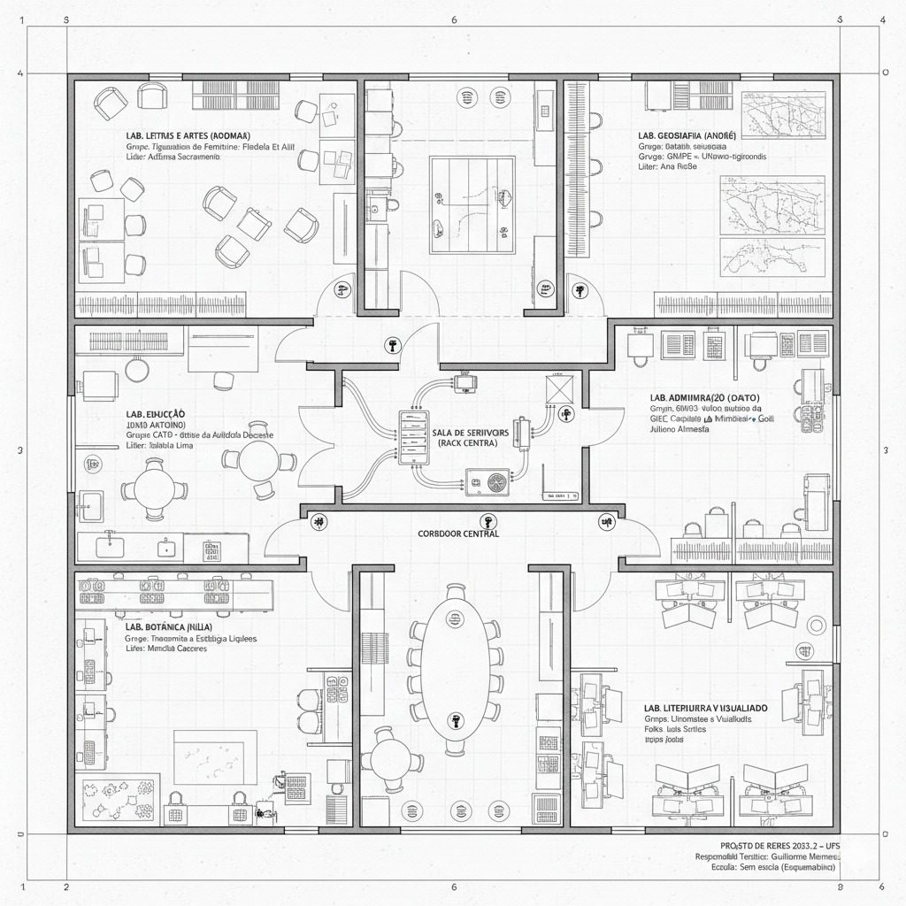

[](https://classroom.github.com/a/iKZ6PjjS)

# Condomínio de Laboratórios de Pesquisa - Campus Alberto Carvalho

## Identificação do Projeto
**Projeto de Redes de Computadores - 2025.2**
**Universidade Federal de Sergipe (UFS)**

Este repositório atua como o **Orquestrador Central** do Condomínio de Laboratórios. Ele é responsável por instanciar os serviços compartilhados e prover o portal de acesso aos laboratórios individuais dos pesquisadores.

## Arquitetura da Solução
A infraestrutura foi projetada utilizando **Docker Compose** para orquestrar múltiplos containers simultaneamente na nuvem **AWS (EC2)**.

### Serviços Rodando neste Orquestrador:
1.  **Portal do Condomínio (Nginx):** Interface web central que redireciona para os 6 laboratórios individuais hospedados em instâncias distintas.
2.  **Zipline (Aplicação):** Sistema de compartilhamento de arquivos grandes (imagens de alta resolução, datasets, vídeos) para uso interno dos pesquisadores.
3.  **PostgreSQL (Banco de Dados):** Persistência de dados segura para o sistema Zipline.

## Membros do Condomínio (Grupos de Pesquisa)

| Pesquisador | Laboratório / Grupo | Área |
| :--- | :--- | :--- |
| **Adomak Silva** | Figurações do Feminino: Florbela Et Al | Letras e Artes |
| **André Felipe** | GRUPE - Estudos Urbano-regionais | Geografia |
| **Guilherme Menezes** | Literatura e Visualidade | Letras |
| **João Antônio** | CATD - Clínica da Atividade Docente | Educação |
| **José Renato** | GIEC - Gestão da Informação | Administração |
| **Júlia Rocha** | Taxonomia e Ecologia de Liquens | Botânica |

## Documentação Técnica

### Mapa da Rede (Topologia)
A planta baixa lógica e física do condomínio encontra-se na pasta `/docs` deste repositório, detalhando o cabeamento estruturado e a distribuição das salas.

### Estrutura de Arquivos
* `docker-compose.yml`: Definição dos serviços, redes e volumes.
* `index.html`: Código fonte do Portal de Acesso.
* `/uploads`: Volume persistente para arquivos do Zipline.

---
## Identificação da Planta Baixa do Condomínio

### Fonte : Gerado por IA pelo https://gemini.google.com/
---

## Instruções de Instalação e Execução (AWS EC2)

Siga os passos abaixo para implantar o orquestrador em uma instância Ubuntu na AWS.

### 1. Preparação do Ambiente
Acesse a instância via SSH e instale o Docker e o Docker Compose:

```bash
sudo apt update
sudo apt install docker.io docker-compose -y

2. Clonagem e Configuração
Baixe este repositório para o servidor:

cd ~

git clone git@github-academico:DCOMP-UFS/2025-2-lab-t1-campus-professor-alberto-carvalho.git

cd 2025-2-lab-t1-campus-professor-alberto-carvalho

3. Execução dos Serviços
sudo docker-compose up -d

4. Verificação
Confira se os 3 containers estão ativos:
sudo docker-compose ps

Links de Acesso
Portal do Condomínio: http://ec2-107-20-12-99.compute-1.amazonaws.com

Sistema Zipline (Arquivos): http://[IP-PUBLICO-DA-EC2]:3000
```
---

### 2. Passo a Passo Técnico: Como rodar na AWS (Para você fazer agora)

Para que o orquestrador funcione, você precisa garantir que os arquivos `docker-compose.yml` e `index.html` (que criamos na resposta anterior) estejam no GitHub do grupo.

**Na Instância AWS (EC2):**

1.  **Libere as Portas no Firewall (Security Group):**
    * Isso é vital! Vá no console da AWS > Security Groups.
    * Garanta que a **Porta 80** (Portal) e a **Porta 3000** (Zipline) estejam abertas para `0.0.0.0/0`.

2.  **Instale as ferramentas:**
    *(No terminal da AWS)*
    ```bash
    sudo apt update
    sudo apt install docker.io docker-compose -y
    ```

3.  **Baixe o Repositório do Grupo:**
    ```bash
    git clone https://github.com/SEU-USUARIO/NOME-DO-REPO-DO-GRUPO.git
    cd NOME-DO-REPO-DO-GRUPO
    ```

4.  **Rode o Orquestrador:**
    Aqui está a mágica. Em vez de `docker run`, usamos:
    ```bash
    sudo docker-compose up -d
    ```
    *O sistema vai baixar o Postgres, o Zipline e o Nginx automaticamente e ligar tudo.*

5.  **Teste:**
    * Acesse `http://SEU-IP-DA-AWS` -> Deve abrir o Portal com os botões.
    * Acesse `http://SEU-IP-DA-AWS:3000` -> Deve abrir a tela de login/setup do Zipline.

**Dica de Ouro:** Se algum colega ainda não terminou o site dele, o botão no portal vai dar erro 404. Isso é normal. Assim que eles te passarem o link da AWS deles, você edita o `index.html` no orquestrador e atualiza.

```bash
# Subir atualizacao
cd ~

sudo cp -r ~/2025-2-lab-t1-campus-professor-alberto-carvalho/* /var/www/site-contratado/

cd /var/www/site-contratado/

# Este comando recria a imagem (build) e reinicia os containers (up) 
# apenas se houver mudanças, tudo em segundo plano (-d)
sudo docker-compose up -d --build

```

---
2. Remova containers órfãos (por garantia):
```bash
sudo docker rm -f $(sudo docker ps -aq --filter name=zipline)
```
